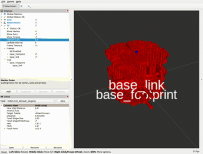

# Section 4: Locomotion

| Type of locomotion | Pros                                                         | Cons                                                         |
| ------------------ | ------------------------------------------------------------ | ------------------------------------------------------------ |
| Legged             | Agile and adaptable to unstructured terrain. Can jump, run, keep balance. | Complexity of control system                                 |
| Wheeled            | Faster, more efficient and simple                            | Valid only for artificial environments. Inefficient e.g. in rough or soft ground (sand) |
| Aerial             | 3D                                                           | low payload                                                  |

Wheeled architectures

* differential drive: two wheels powered by motors + other support wheels or castors. Allows rotations and trnaslations in spae

* Ackerman drive: typically rear wheels connected to a motor and front wheels can steer, but can also be front drive or 4 wheels drive. Has a minimum rotation radius.

* omnidirectional drive: 3 or 4 mecanum wheels each connected to a motor. Very flexible. 

Pose in 2D defined by `x`, `y` coordinates and orientation `theta`

Friction: wheels deform and this dissipates energy.  Soft ground deforms permanently and dissipates even more. 

ROS has tools to Model , Visualize and Simulate to streamline development and debugging

URDF - Unifier Robot Description Format. Based in XML

<link>  reference frame, can associate:

​	<name>

​	<visual> visualization dimensions or mesh 

​	<collision> <inertial> physical properties

<joint> connection between parent and child links forming a tree structure

## Creating an URDF model

* create a package and build it:

```bash
$ ros2 pkg create --build-type ament_cmake bumperbot_description
going to create a new package
package name: bumperbot_description
destination directory: /home/mhered/bumperbot_ws/src
package format: 3
version: 0.0.0
description: TODO: Package description
maintainer: ['mhered <manolo.heredia@gmail.com>']
licenses: ['TODO: License declaration']
build type: ament_cmake
dependencies: []
creating folder ./bumperbot_description
creating ./bumperbot_description/package.xml
creating source and include folder
creating folder ./bumperbot_description/src
creating folder ./bumperbot_description/include/bumperbot_description
creating ./bumperbot_description/CMakeLists.txt
$ cd ..
$ colcon build
Starting >>> bumperbot_cpp_examples
Starting >>> bumperbot_description
Starting >>> bumperbot_py_examples
Finished <<< bumperbot_cpp_examples [0.28s]              
Finished <<< bumperbot_description [0.57s]  
Finished <<< bumperbot_py_examples [0.81s]          

Summary: 3 packages finished [1.06s]
```

* create a new folders  `urdf` and `meshes` copy STL files inside `meshes` and a  `bumperbot.urdf.xacro` file inside `urdf`:

```bash
$ tree
~/bumperbot_ws/src/bumperbot_description
├── CMakeLists.txt
├── include
│   └── bumperbot_description
├── meshes
│   ├── base_link.STL
│   ├── caster_front_link.STL
│   ├── caster_rear_link.STL
│   ├── imu_link.STL
│   ├── wheel_left_link.STL
│   └── wheel_right_link.STL
├── package.xml
├── src
└── urdf
    └── bumperbot.urdf.xacro
```


```xml
<?xml version="1.0"?>

<robot xmlns:xacro="https://www.ros.org/wiki/xacro" name="bumperbot">

    <!--base_footprint link-->
    <link name="base_footprint"/>

    <!--base_link link-->
    <link name="base_link">
        <visual>
            <origin xyz="0.0 0.0 0.0" rpy="0.0 0.0 0.0"/>

            <geometry>
                <mesh filename="package://bumperbot_description/meshes/base_link.STL"/>
            </geometry>
        </visual>
    </link>


    <!--base_joint joint-->
    <joint name="base_joint" type="fixed">
        <parent link="base_footprint"/>
        <child link="base_link"/>
        <origin xyz="0.0 0.0 0.033" rpy="0.0 0.0 0.0"/>
        
    </joint>

</robot>
```

* To install `meshes` and `urdf` folders add following lines to `CMakeLists.txt` :

```cmake
# install folders
install(
  DIRECTORY meshes urdf
  DESTINATION share/${PROJECT_NAME}
)
```

* as usual, build with colcon, then source in a different terminal. 
* install urdf-tutorial library:

```bash 
$ sudo apt-get install ros-jazzy-urdf-tutorial
```

And use this launch file, which is general purpose, to display the URDF model:

```bash
$ ros2 launch urdf_tutorial display.launch.py model:=/home/mhered/bumperbot_ws/src/bumperbot_description/urdf/bumperbot.urdf.xacro
```



* Add the rest of the links: wheels with `continuous` joints and casters with fixed joints, adjusting axes translations and rotations from measurements in CAD. Remember you can evaluate expressions and use some literals, e.g. `${pi/2}` See result in [bumperbot.urdf.xacro](./src/bumperbot_description/urdf/bumperbot.urdf.xacro)
* Instructions to change display colors for meshes: https://answers.gazebosim.org//question/13718/how-to-add-a-colormaterial-to-a-stl-mesh-in-an-urdf-file/


## rviz

Tool that allows visualizing robots, obstacles, maps, or simulated sensor readings e.g. from laser scanners or cameras using plugins that produce intuitive graphical displays from messages published in certain ROS2 topics

## Visualizing the robot (#4.37)

Requires 3 steps: 

1. Run the state publisher node which reads the robot description and publishes the state of the frames in a ros topic

   As  `robot_state_publisher` is a general purpose node, we need to specify the robot description in URDF. We used xacro, so we need to pass it through the xacro "translator" first so the value we pass to the `robot_description` parameter should be `"$ (xacro FULL_PATH_TO_XACRO_FILE )"`: 

```bash
$ ros2 run robot_state_publisher robot_state_publisher --ros-args -p robot_description:="$( xacro /home/mhered/bumperbot_ws/src/bumperbot_description/urdf/bumperbot.urdf.xacro)"
Parsing robot urdf xml string.
Link base_link had 4 children
Link caster_front_link had 0 children
Link caster_rear_link had 0 children
Link wheel_left_link had 0 children
Link wheel_right_link had 0 children
[INFO] [1720398408.822184680] [robot_state_publisher]: got segment base_footprint
[INFO] [1720398408.822233582] [robot_state_publisher]: got segment base_link
[INFO] [1720398408.822240288] [robot_state_publisher]: got segment caster_front_link
[INFO] [1720398408.822246154] [robot_state_publisher]: got segment caster_rear_link
[INFO] [1720398408.822251902] [robot_state_publisher]: got segment wheel_left_link
[INFO] [1720398408.822257250] [robot_state_publisher]: got segment wheel_right_link
```

2. On a separate terminal we source our workspace and launch another node that creates a GUI with sliders for all movable joints:

```bash
$ source install/setup.bash
$ ros2 run joint_state_publisher_gui joint_state_publisher_gui 
[INFO] [1720398684.498330979] [joint_state_publisher]: Waiting for robot_description to be published on the robot_description topic...
[INFO] [1720398684.516544650] [joint_state_publisher]: Centering
[INFO] [1720398684.593048187] [joint_state_publisher]: Centering
```

3. On a third terminal we launch rviz for visualization:

```bash
$ ros2 run rviz2 rviz2
```

And configure it: 

* Set **Fixed frame** to `base_footprint` to get rid of the error 
* Add **TF** plugin, to see the frames. Click  **Show Names** and change **Marker Scale** to **0.5** to improve visibility
* Add the **RobotModel** plugin, and set **Description Topic** to `/robot_description` to visualize the robot
* We can save this configuration as `display.rviz` in [./src/bumperbot_description/rviz](./src/bumperbot_description/rviz), and recover calling rviz with `$ ros2 run rviz2 rviz2 -d /home/mhered/bumperbot_ws/src/bumperbot_description/rviz/display.rviz`


With the sliders you can actuate the joints

### Launch files (#4.38)

Launch files allow automating the process of launching several nodes in sequence in different terminals, configuring parameters, even launching external processes etc. with a single command

Can be written in python (default in ROS2), and also in xml and yaml with some limitations. 

Essentially they list instructions to execute in order

called with the command `ros2 launch`

Principle: composition and reusability. Create a launch file for each logically separated functionality. Then several launch files can be called by a master launch file that considers dependencies and priorities.

The list of operations and applications to start by a launch file is called the launch description. We will use two libraries to provide these instructions:

* `launch` > functionalities for managing and configuring the launch file itself and its interfaces with the outside
* `launch_ros` > functionalities specific to ROS2 such as managing nodes, parameters

## Visualizing the robot with a launch file (#4.39)

1. Create [./src/bumperbot_description/launch](./src/bumperbot_description/launch) folder and write `display.launch.py` which:

   * declares `model_arg` string parameter equivalent to `/home/mhered/bumperbot_ws/src/bumperbot_description/urdf/bumperbot.urdf.xacro`
   * declares `robot_state_publisher_node` node equivalent to:

   ```bash
   $ ros2 run robot_state_publisher robot_state_publisher --ros-args -p robot_description:="$( xacro /home/mhered/bumperbot_ws/src/bumperbot_description/urdf/bumperbot.urdf.xacro)"
   ```

   * declares `robot_state_publisher_gui_node` node equivalent to:

   ```bash
   $ ros2 run joint_state_publisher_gui joint_state_publisher_gui
   ```

   * declares `rviz_node` node with parameter equivalent to:

   ```bash
   $ ros2 run rviz2 rviz2 -d /home/mhered/bumperbot_ws/src/bumperbot_description/rviz/display.rviz
   ```

   

2. install folders `rviz` and `launch` in `CMakeLists.txt`

```cmake
...
# install folders
install(
  DIRECTORY meshes urdf rviz launch
  DESTINATION share/${PROJECT_NAME}
)
...
```


1. add dependencies in `package.xml`:

```xml
...  
<exec_depend>robot_state_publisher</exec_depend>
<exec_depend>robot_state_publisher_gui</exec_depend>
<exec_depend>rviz2</exec_depend>
<exec_depend>ros2launch</exec_depend>
...
```

4. build with `colcon build`
5. in another terminal source and run:

```bash
$ source install/setup.bash
$ ros2 launch bumperbot_description display.launch.py
```


## Gazebo

Physics engine widely used for robotics. Simulates gravity, friction, acceleration, etc for simulating and debugging robotics applications.

Allows simulating robot movements and sensors in a virtual environment

A real robot publishes messages related to its status e.g. `/joint_states` and sensors publish data in dedicated topics e.g. `/imu` or `/scan`. Other nodes subscribe to these topics and use the messages, e.g. rviz for visualization.

Gazebo replicates the messages published by the real robot. ROS2 nodes subscribed to these topics to implement other functionalities ignore whether the data comes from a real or simulated robot, therefore gazebo allows to simulate, test and debug these ROS2 nodes

We need to adapt the URDF and launch files.

Add physical properties to simulate forces and movements in the URDF:

1. Add <inertial> and <collision> tags to the links. Recommends Solidworks exporter for <inertial> properties.

2. For other tags needed only for gazebo (e.g. friction coefficients, solver accuracy, direction of rotation etc) it is better to create another file `bumperbot_gazebo.urdf` and embed it with `    <xacro:include filename="$(find bumperbot_description)/urdf/bumperbot_gazebo.urdf"/>` as this improves readability
