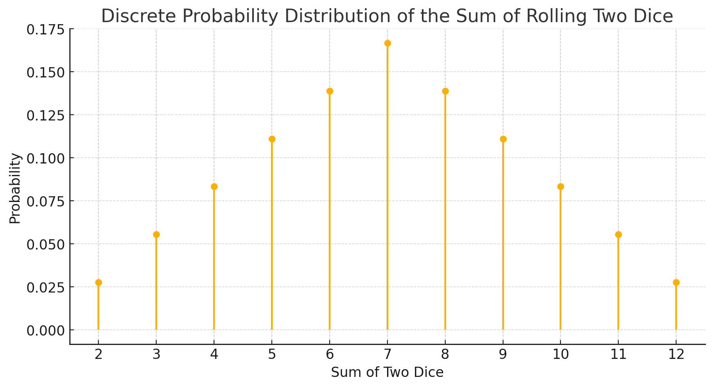

# Section 10: Probability for Robotics

## Motivation
Robots work in an unstructured and unpredictable environment that changes constantly with many sources of uncertainty:

- External factors (changes in environment, dynamic obstacles, weather conditions, etc)
- Actuators (inaccuracies, vibration, high temperature, etc) 
- Sensors (wrong readings, noise, measurement errors, sensor accuracy)
- Errors in odometry and kinematic model

Due to this robotics applications require a probabilistic not deterministic approach. For example, in localization we cannot fully trust the sensors to know where the robot is. Instead we can assign probabilities to each position to account for uncertainties, then we update the probabilities when new sensor data is available. The advantage is that accuracy improves when we accumulate more data.

## Random variables

Random variable: a limited set of possible outcomes resulting from a random experiment, e.g.: 

* Dice roll: $X=\{1, 2, 3, 4, 5, 6\}$ 
* Coin toss: $X=\{heads, tails\}$

We can assign probabilities to outcomes, e.g.
$$
\begin{align*}
P(X = heads) $=0.5
\\
P(X = tails) $=0.5
\end{align*}
$$
We typically refer to P(heads), P(tails). 

Important result: the sum of the probabilities of all possible outcomes must be 1 (100%).
$$
\sum_{x}{P(X=x) =1}
$$
Also, the probability of any outcome must be a value between 0 (impossible) and 1 (certain!):
$$
0 \leq P(X=x) \leq 1
$$
The combined probability of two independent events taking place can be calculated by multiplying the probabilities of each event: 
$$
\begin{align*}
P(X=heads)&=1/2
\\
P(Y=2)&=1/6
\\
P(X=heads, Y=2) &= P(X=heads \cap Y=2)= 1/12
\end{align*}
$$
More generally:
$$
P(X \cap Y) = P(X) \cdot P(Y)
$$

## Conditional probability

When the probability of one event affects the probability of another event, we say the two events are dependent. For example the probability of detecting an obstacle with a sensor $Y=\{yes,no\}$ depends on the robot being at a given location $X=\{A,B\}$ where position A is near the obstacle and B is far. 

The combined probability of two dependent events is not the product of the two probabilities. We introduce the conditional probability: the probability that an event Y happens **given** that another dependent event X has already been observed: $P(Y|X)$, e.g.
$$
\begin{align*}
P(X=A)=0.5 &, P(X=B)=0.5
\\
P(Y=yes | X = A)&=0.8
\\
P(X=A \cap Y=yes) &= 0.5 \cdot 0.8 = 0.4 
\end{align*}
$$
More generally, the combined probability of two dependent events:
$$
P (X \cap  Y) = P(X)\cdot P(Y | X)
$$
hence
$$
P(Y | X) = \frac{P (X \cap  Y)}{P(X)}
$$

## Probability distributions 

The probability distribution function that maps all the values that a random variable can take with their likelihood. Can be discrete or continuous. 

A uniform distribution assigns the same probability to all possible values. Good starting point or initial guess if there is no information

e.g. result of rolling two dices:

$X=\{2, 3, 4, 5, 6, 7, 8, 9, 10,11, 12\}$

$$P(X)=\{\frac{1}{36},\frac{2}{36},\frac{3}{36},\frac{4}{36},\frac{5}{36},\frac{6}{36},\frac{5}{36},\frac{4}{36},\frac{3}{36},\frac{2}{36},\frac{1}{36}\}$$

Mean: most common value
$$
\mu &= \sum_{x} {x \cdot P(x)} 
\\
\mu &= 2 \cdot \frac{1}{36}+3 \cdot \frac{2}{36}+... = 7
$$
Variance, a metric that describes how far the distribution is from the mean:
$$
\begin{align*}
\sigma² &= \sum_{x}{P(x)\cdot (x-\mu)²}
\\
\sigma² &= \frac{1}{36} \cdot (2-7)²+\frac{2}{36} \cdot (3-7)²+...=5.83
\end{align*}
$$
Standard deviation: larger means higher uncertainty
$$
\sigma = \sqrt{\sigma^2} = 2.4
$$

## Gaussian distributions

Gaussian or Normal distributions have a simple equation that depends only on mean and variance:
$$
f(x) = \frac{1}{\sigma \sqrt{2 \pi}}e^{-\frac{1}{2}(\frac{x-\mu}{\sigma})²}
$$
Area under the curve must add to 1.

Easy to combine processes described by Gaussians. Given two distributions (that describe the probability of two random processes A and B).

* Probability of A **and** B ocurring is also a Gaussian:

$$
P(A \cap B) = P(C) = P(A) \cdot P(B)
\\
\mu_{C} = \frac{\sigma_B^2 \cdot \mu_{A} + \sigma_A^2 \cdot \mu_{B}}{\sigma_B^2 +\sigma_A^2 }
\\
\sigma_C^2 = \frac{1}{\frac{1}{\sigma_B^2}+\frac{1}{\sigma_A^2}}
$$

* Probability of A **or** B ocurring is also a Gaussian :

$$
P(A \cup  B) = P(C) = P(A) + P(B)
\\
\mu_{C} = \mu_{A} + \mu_{B}
\\
\sigma_C^2 = \sigma_B^2+\sigma_A^2
$$

## Total Probability Theorem

Given event $A$ and dependent event $B$ for which we can define mutually exclusive and collectively exhaustive subsets $B_i$ for $i=1,...,n$
$$
P(A) = \sum_i {P(B_i \cap A)} = \sum_i{P(A|B_i)P(B_i)}
$$
The theorem breaks down the probability of $A$ into contributions from each $B_i$, weighted by how likely each $B_i$ is.Useful when it is easier to calculate $P(B_i)$ than $P(A)$

Example: a factory has three machines producing items (Machine 1 produces 30%, Machine 2 50%, and Machine 3: 20%), each with a different defect rate (Machine 1: 5%, Machine 2: 3%, Machine 3: 10%).

The probability of a defective item A in the factory production can be calculated using the total probability theorem as the sum of the probability of a defect for each machine (i.e. its defect rate) times the probability that the item comes from this machine (i.e. the machine share of the total production):
$$
P(A)&=P(A∣B_1)P(B_1)+P(A∣B_2)P(B_2)+P(A∣B_3)P(B_3) \\&= 5\% \cdot 30\% +  3\% \cdot 50\% +  10\% \cdot 20\% = 5\%
$$

## Bayes rule

We know from set theorem that intersection is commutative, hence:
$$
P(A \cap B) = P(B \cap A)
\\ 
P(A∣B)P(B) = P(B∣A)P(A)
$$
Refactoring we get the Bayes rule:
$$
P(A∣B) = \frac{P(B∣A)P(A)}{P(B)}
$$
which describes how to update the probability of an event when new information appears.

Definitions:

* **Posterior probability** P(A|B) "Probability of A given B": updated probabiltiy of event A when we observe a dependent event B
* **Prior** P(A): initial guess that we want to update based in new observations
* **Marginal probability** P(B): overall probability of observing event B at all
* **Likelihood** P(B|A) "Probability of B given A": probability of B assuming A occured

We will use this to recursively improve our estimation of robot localization based on new sensor data

## Sensor noise

Real sensors produce noisy signal with added random error
